## 背景

MC，全称 Minecraft, 由 Mojong 工作室开发的一款开发沙盒游戏。截至2023年10月，《我的世界》拥有3亿销量和1.5亿月活跃用户，打破[俄罗斯方块](https://zh.wikipedia.org/wiki/%E4%BF%84%E7%BE%85%E6%96%AF%E6%96%B9%E5%A1%8A "俄罗斯方块")的纪录并成为[有史以来最畅销的电子游戏](https://zh.wikipedia.org/wiki/%E7%94%B5%E5%AD%90%E6%B8%B8%E6%88%8F%E9%94%80%E9%87%8F%E6%8E%92%E8%A1%8C%E5%88%97%E8%A1%A8 "电子游戏销量排行列表")，其拥有庞大且活跃的游戏社区。

MC 中存在三个维度，分别是主世界、地狱和末地。地狱于 2010 年 9 月 18 日，末地于 2011 年 11 月 18 日添加，地狱于 2020 年 6 月 23 日进行过新内容的添加，而末地仅在 2016 年 2 月 29 日有过一次更新，至今已快九年之久。相比其余2个世界的更新幅度，末地目前的可玩性远不及它们。末地的内容已经远远无法满足当前玩家群体的需要，在很多网站有关末地更新的讨论此起彼伏。

基于此，我们希望为 MC 开发以“末地”为主题的模组，旨在丰富末地探险内容，提高玩家游戏体验。

## 用户场景分析

- 核心价值：为Minecraft玩家提供更具挑战性和多样化的末地探险体验。  
- 关键功能：新增物品、方块、地形、生物机制。
- 目标用户：Minecraft 1.20.1 玩家，熟悉末地基础玩法。

### 玩家群体

| 玩家类型       | 特征描述                | 关注点              | 对应功能                 |
| -------------- | ----------------------- | ------------------- | ------------------------ |
| **冒险探索者** | 热衷末地探索/遗迹挑战   | 生存能力/逃脱手段   | 紫颂果干、末影斗篷     |
| **PVP竞技者**  | 专注玩家对战/战术组合   | 战斗突袭/控制能力   | 瞬移药水、虚空之刃     |
| **红石工程师** | 擅长自动化系统建造      | 功能性方块的实用性  | 末影共振器、珍珠储存罐 |
| **BOSS挑战者** | 追求高难度战斗/稀有掉落 | 新生物机制/装备强度 | 末地守护者、末地核心 |

### 假想场景

#### 场景一：生存遇险

- 参与者：冒险探索者
- 用例一：从地底回到地表时意外被沙砾窒息 / 意外掉入岩浆池。
	- 操作：
		1. 快速食用紫颂果干。
		2. 传送至 5 格内安全区域。
	- 说明：利用紫颂果干的极快的食用速度来逃脱困境。
- 用例二：在挑战末影龙时，意外吸引末影人仇恨。
	- 操作：装备末影斗篷。
	- 说明：利用末影斗篷消除末影人仇恨，让玩家可以专心挑战末影龙。
- 用例三：玩家在末地建造庇护所。如果玩家意外死亡，需要从主世界跑回末地。
	- 操作：使用末地重生锚，在末地庇护所设置出生点。
	- 说明：原版仅允许在主世界和地狱设置出生点。

#### 场景二：末地突袭战

- 参与者：多名 PVP 玩家（攻击方 VS 防守方）  
- 功能使用：瞬移药水、潜影贝鞋、末影弓、末影护腿等等。
- 关键交互：  
	1. 攻击方投掷瞬移药水打乱防守阵型。
	2. 攻击方利用末影弓使防守方漂浮。
	3. 防守方使用潜影贝鞋免疫漂浮控制。
	4. 双方利用末影护腿概率瞬移免伤进行缠斗。

#### 场景三：末地自动化农场

- 参与者：红石工程师
- 建造流程
	1. 用共振器吸引末影人到指定区域。
	2. 利用处死装置获取珍珠。
	3. 将珍珠存储到珍珠存储罐。
- 说明：珍珠存储罐比箱子可以容纳更多末影珍珠。

#### 场景四：地牢挑战

- 用例一：发现末影祭坛
	- 参与者：冒险探索者
	- 阶段流程：
		1. 探险时意外发现末影祭坛。
		2. 解决刷新的怪物。
		3. 获取奖励。
		
- 用例二：挑战末地核心 
	- 参与者：BOSS 挑战者
	- 阶段流程：  
		1. 根据末地指南针找到末地核心。
		2. 突破层层关卡抵达顶层。
		3. 迎战末地守护者 BOSS。
		4. 获取末影核心制作顶级装备。

> 对于管理系统，一般使用页面原型来进行可视化的用户场景分析。不过我们这里游戏就无法使用这种办法，假想用户故事是一个很好的方法。

## 功能清单

根据上面[用户场景分析](需求分析文档.md#用户场景分析)总结出来。

### 物品

1. 末影锭
	- 合成配方：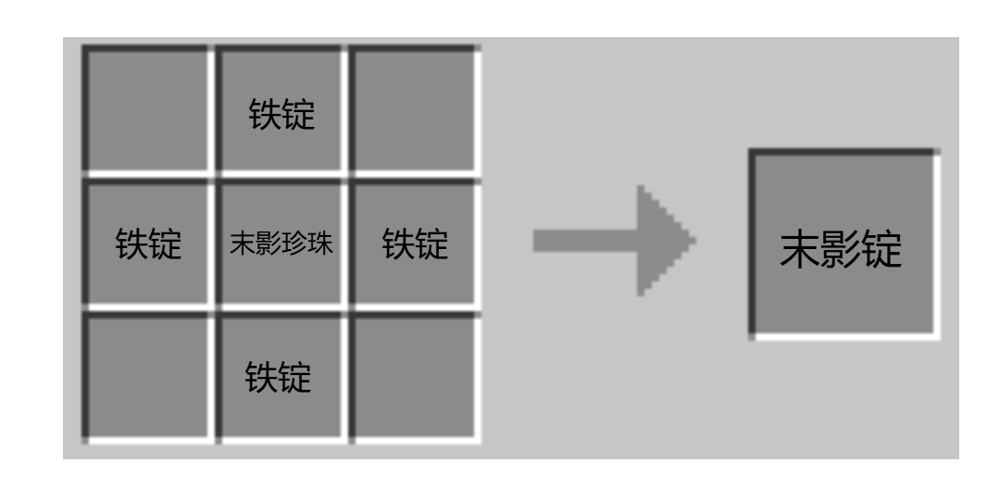
	- 功能
2. 末影护腿
	- 合成配方：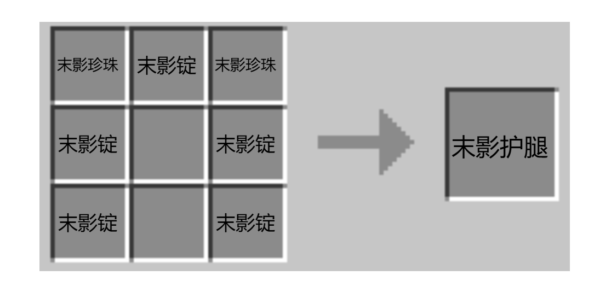
	- 功能：护甲值比钻石护腿一致，受击概率瞬移免伤。
3. 末影斗篷
	- 合成配方：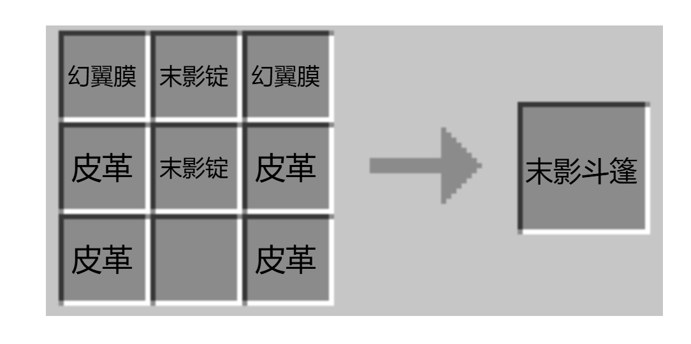
	- 功能：消除末影人仇恨，潜行可以隐身。
	- 说明：占用胸甲位，护甲值和铁甲相同，但耐久要低很多。
4. 虚空之刃
	 - 合成配方：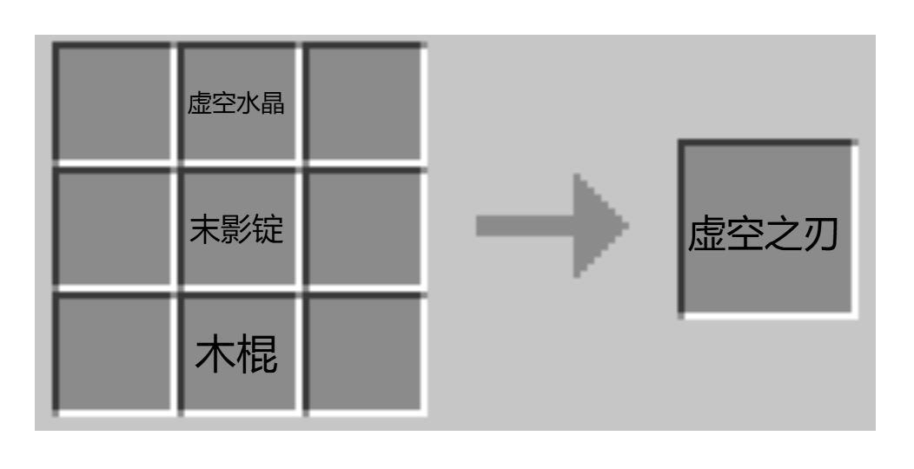
	 - 功能：攻击额外造成虚空伤害（无视护甲）。
5. 末影弓
	- 合成配方：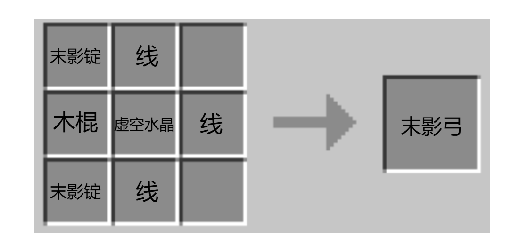
	- 功能：攻击让目标升空并附加几秒漂浮效果。
合成原料。
6. 末影珍珠粉末
	- 合成配方：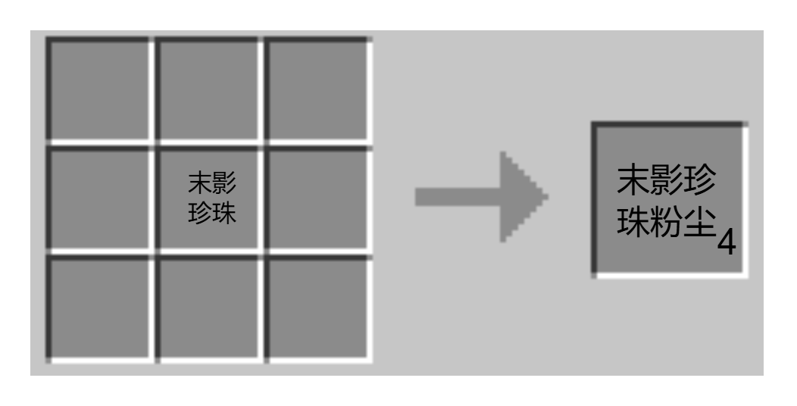
	- 功能：可用于制作瞬移药水、末影指南针。
7. 瞬移药水
	- 使用末影珍珠粉尘酿药，有普通、喷溅和滞留型。 
	- 酿造配方：粗制的药水 + 末影珍珠粉尘 ⇒瞬移药水，其喷溅型、滞留型配方和其它药水同。
	- 功能：让波及范围内的生物随机瞬移。
8. 末影指南针
	- 合成配方：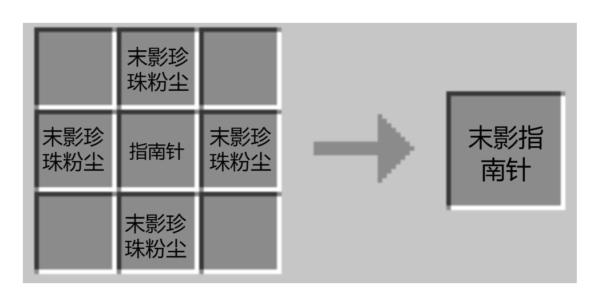
	- 功能：指向末地核心位置。类似普通指南针和磁石。
9. 紫颂果干
	- 合成配方：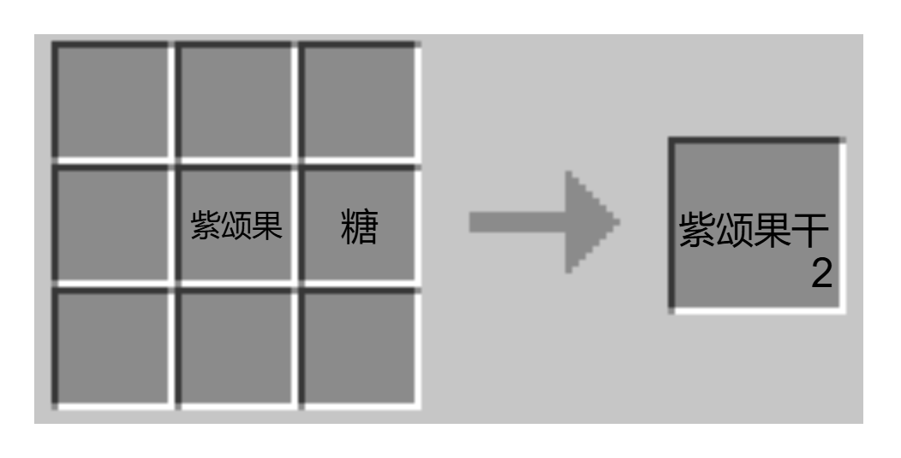
	- 功能：较紫颂果更快的食用速度，饱食度较紫颂果略微降低，食用后半径五格随机传送。
10. 潜影贝鞋
	- 合成配方：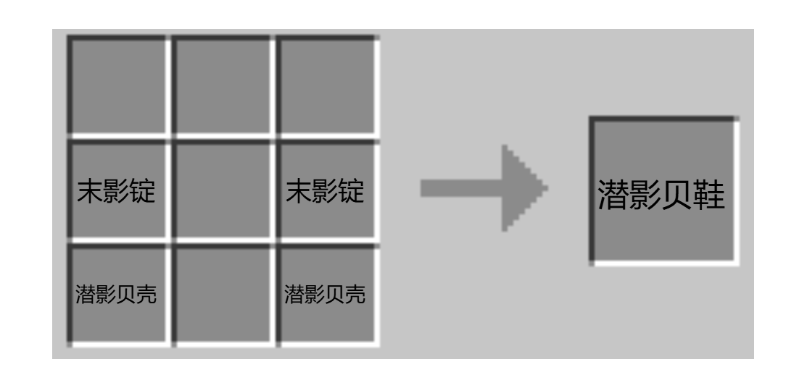
	- 功能：护甲值和钻石鞋子一致，可以免疫漂浮效果。
	
### 功能方块

1.  虚空水晶
	  - 获取：生成于末地岛屿底部。
	  - 功能：和末影锭结合制作末影武器等。
2. 末地重生锚
	- 合成配方：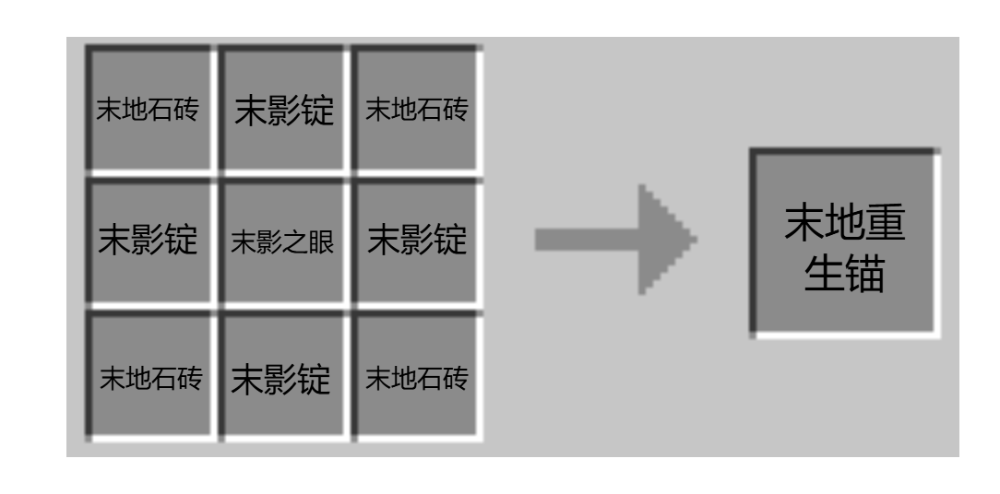
	- 功能：在末地设置传送点。
	- 说明：类似地狱重生锚，但只能在末地使用，使用末影珍珠充能。
3. 末影共振器
	- 合成配方：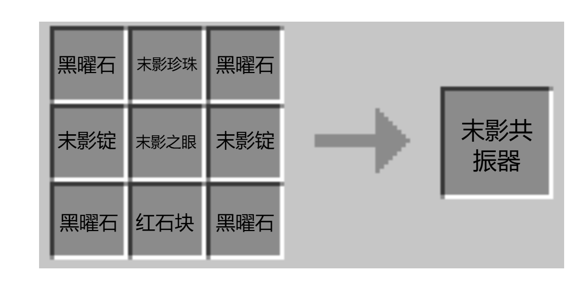
	- 功能：激活时吸引半径 16 格的末影人。
	- 说明：使用红石控制，可用于自动化珍珠农场。
4. 珍珠储存罐
	- 合成配方：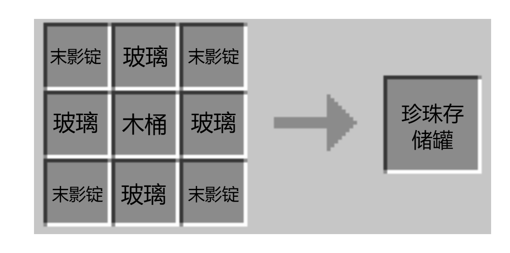
	- 只能存储珍珠，容纳空间为 54 格（和大箱子一致），可以随身携带（破坏方块时，内部珍珠不会出来）。
5. 传送锚（待定）

### 建筑

1. 末地核心
	  - 半开放式地牢，在虚空附近生成。
	  - 包含试炼幽影翼、潜影贝、旋风人等刷怪笼。
	  - 包含丰富战利品。
2. 末影祭坛
	- 小型结构，随机生成在末地外岛  
	- 包含试炼潜影贝和幽影翼刷怪笼。
	- 包含简单战利品。

### 生物

1. 幽影翼
	- 生成：和主世界相反，在末地虚空边缘生成。
	- 特性：和幻翼相同，但是受到攻击时概率瞬移。
2. 末地守护者
	- 生成：在末地核心底层生成。
	- 特性：BOSS 级生物，拥有两种形态。掉落虚空核心。
	- 描述：未进入战斗状态时，静止不动。进入战斗状态后，有两种阶段。
		- 第一阶段（血量 50 % 以上）：静止不动，召唤幽影翼、潜影贝和其仆从（穿有装备的僵尸、小白等等，自定义生物）。
		- 第二阶段（血量 50% 以下）：每隔一段时间锁定玩家当前位置，立刻裂痕中心生成微型黑洞，吸附半径8格内所有实体并在 2 秒后造成持续伤害（类似龙息释放）。如果有生物死亡，会恢复血量。
		- 死亡：产生大范围黑洞，二十秒后爆炸，黑洞内生物受到巨额伤害。
		- 说明：
			1. 受到攻击时概率闪避并瞬移，免疫弓箭（和小黑一致）。
			2. 护甲值比较高，引导玩家使用虚空之刃对战。
			3. 其 BOSS 房不可被破坏。
			4. 处于待机状态时血量恢复非常快。

> 本段内容是对后面需求分析的前置知识。在游戏启动时，实际上会启动客户端和服务器，也就是 B/S 架构。即使是**单机也会运行本地服务器**，它们之间的交流便是数据。
> 
> - 客户端是玩家所运行的游戏程序。主要负责
> 	- 图形渲染（如区块、实体、物品显示）
>  	- 玩家操作（如移动、挖掘、攻击）
> 	- UI 与声音播放
> 	- 将**你的操作发送给服务器，并接受服务器发回的游戏世界状态**。
> - 服务器是世界状态的唯一控制者。主要负责
> 	- 管理世界逻辑（如方块变化、实体更新、命令执行、红石逻辑等）。
> 	- 校验玩家操作是否合法。
> 	- 同步所有玩家的世界数据。
> 	- 执行插件或数据包逻辑。

## 结构化需求分析

### 数据流图

玩家在游玩时产生的相关数据，各种行为状态传递给游戏系统处理。游戏系统根据这些行为进行反馈。

> 实际上在输入处理这块，游戏中不同行为对应不同操作，这也代表涉及的输入类型非常非常多。使用数据流图难以对整体需求分析进行描述，描述出来也会显得非常庞杂。下面是我列举出来涉及的一部分内容：
> 
> 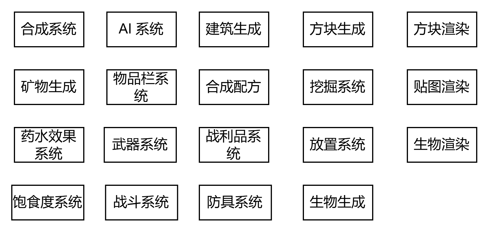
> 
> 如果每个都描述，我会累死的。而且在绘制数据流图中，明显能感觉到**无法把握需求重点**，这和需求分析的目的相违背了。精力全部耗费到了游戏底层上面。甚至我感觉**这都不是数据流图了，而是面向对象图**。个人认为在实际项目中不可能这样做的，我们想想，MC 本身是 Java 语言所写，而 Java 是面向对象语言，也许使用面向对象分析会容易非常多。
> 
> 某种意义上讲，数据的流动已经被游戏引擎底层封装好了，我们这里即使描述也是在描述游戏底层。就需求分析上看，一点意义都没有。
> 
> 基于上述原因，数据流图仅完成到第一层，用来理清系统的整体功能和数据流向。

### E-R 图

> E-R 图负责描述各实体的属性和关系。因为要实现的东西很多，为了简洁，这里将全部物品实例抽象成一个物品，建筑和结构同理。这里就不编号，编号可以用来编写数据字典，但是我们这里比较特殊，编写字典没啥用，这里就忽略了。

这里的物品包括方块物品。

> 这里方块是物品 ER 图的子类，问了 AI，查了 PPT，并没有找到该如何将跨图的方块和物品的关系表示出来的办法。我这里想的可以利用编号，在加以一定的说明。不过我没有画编号……所以就这样凑活吧，姑且利用主键暗示。

> 实际上现代有更常用的针对数据库的 ER 图改版，非常适合用来描述数据库，可以和传统 ER 图相互转换，而且在各种绘图工具上都有广泛采用，像 mermaid、draw.io。不过 MC 模组数据是 NBT/JSON 驱动的，基本用不到数据库，因此这里只能遗憾舍弃。

### 状态转换图

在游戏中，很多都是基于状态 / 事件驱动的，像功能清单中的各种特殊功能，物品的话要看玩家有没有“使用”，功能方块的话要看玩家有没有“启动”，生物的话要看玩家有没有“触发”。

这里不同的物品有不同的状态。这张图仅涉及一个物品的状态转换。

## 面向对象需求分析

### 用例图

> 这个图已经是简化过的，重点描述其功能用例，并不涉及合成配方、纹理显示、玩家的状态（创造、生存模式）等等。如果简化过度，会导致不同用例间的共用用例不明显。

> 关于生物，并不适合使用用例图描述。生物更适合使用时序图和状态转换图，因为在游戏中并非属于用户目标导向。最多描述下遭遇生物或击杀生物。系统并不会提供生物相关的“功能”给玩家（本模组没有）。

> [!NOTE] 用例图不适用的场景
> |场景|问题|推荐图表|
> |---|---|---|
> |生物AI行为逻辑|属于系统内部机制，非用户目标|状态图/活动图|
> |物品合成配方|数据属性描述，缺乏交互性|类图/ER图|
> |物理引擎运作流程|技术实现细节，超出用户视角|序列图/流程图|
> |游戏状态切换|动态过程而非静态功能|状态机图|

