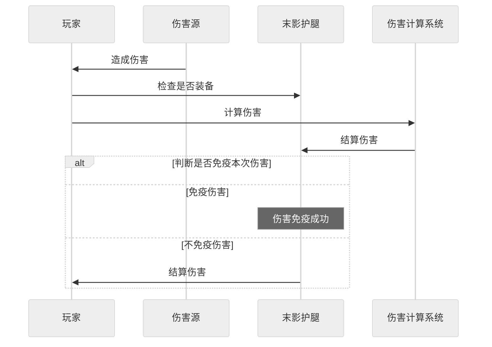
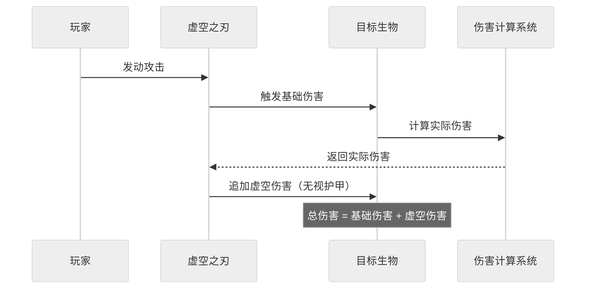
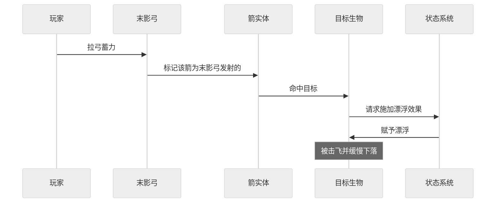
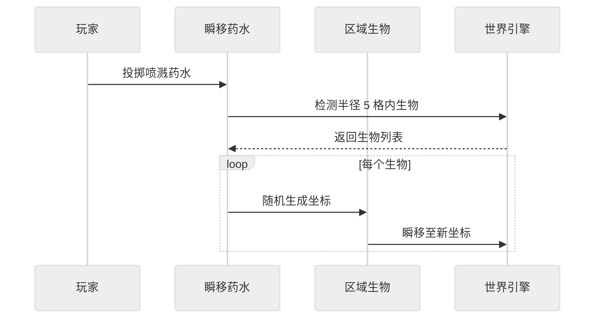
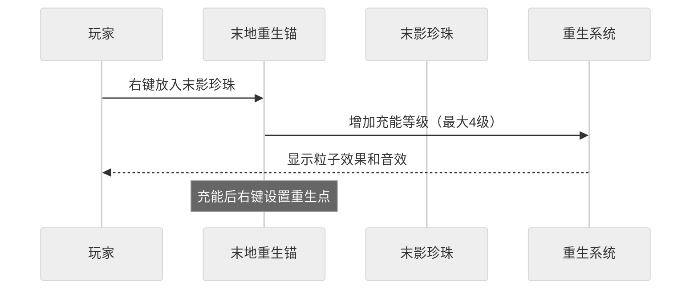
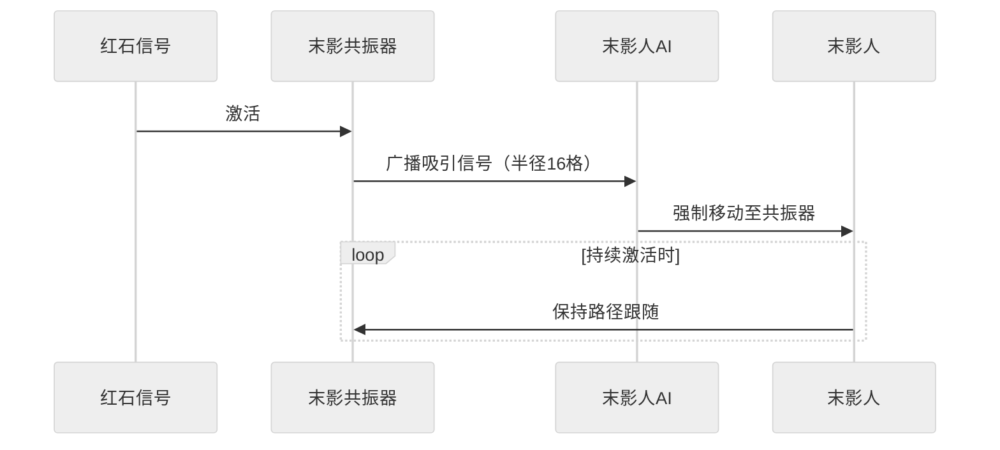

## 背景

MC，全称 Minecraft, 由 Mojong 工作室开发的一款开发沙盒游戏。截至2023年10月，《我的世界》拥有3亿销量和1.5亿月活跃用户，打破[俄罗斯方块](https://zh.wikipedia.org/wiki/%E4%BF%84%E7%BE%85%E6%96%AF%E6%96%B9%E5%A1%8A "俄罗斯方块")的纪录并成为[有史以来最畅销的电子游戏](https://zh.wikipedia.org/wiki/%E7%94%B5%E5%AD%90%E6%B8%B8%E6%88%8F%E9%94%80%E9%87%8F%E6%8E%92%E8%A1%8C%E5%88%97%E8%A1%A8 "电子游戏销量排行列表")，其拥有庞大且活跃的游戏社区。

MC 中存在三个维度，分别是主世界、地狱和末地。地狱于 2010 年 9 月 18 日，末地于 2011 年 11 月 18 日添加，地狱于 2020 年 6 月 23 日进行过新内容的添加，而末地仅在 2016 年 2 月 29 日有过一次更新，至今已快九年之久。相比其余2个世界的更新幅度，末地目前的可玩性远不及它们。末地的内容已经远远无法满足当前玩家群体的需要，在很多网站有关末地更新的讨论此起彼伏。

基于此，我们希望为 MC 开发以“末地”为主题的模组，旨在丰富末地探险内容，提高玩家游戏体验。

## 用户场景分析

- 核心价值：为Minecraft玩家提供更具挑战性和多样化的末地探险体验。  
- 关键功能：新增物品、方块、地形、生物机制。
- 目标用户：Minecraft 1.20.1 玩家，熟悉末地基础玩法。

### 场景一：生存遇险

- 参与者：冒险探索者
- 用例一：从地底回到地表时意外被沙砾窒息 / 意外掉入岩浆池。
	- 操作：
		1. 快速食用紫颂果干。
		2. 传送至 5 格内安全区域。
	- 说明：利用紫颂果干的极快的食用速度来逃脱困境。
- 用例二：在挑战末影龙时，意外吸引末影人仇恨。
	- 操作：装备末影斗篷。
	- 说明：利用末影斗篷消除末影人仇恨，让玩家可以专心挑战末影龙。
- 用例三：玩家在末地建造庇护所。如果玩家意外死亡，需要从主世界跑回末地。
	- 操作：使用末地重生锚，在末地庇护所设置出生点。
	- 说明：原版仅允许在主世界和地狱设置出生点。

### 场景二：末地突袭战

- 参与者：多名 PVP 玩家（攻击方 VS 防守方）  
- 功能使用：瞬移药水、潜影贝鞋、末影弓、末影护腿等等。
- 关键交互：  
	1. 攻击方投掷瞬移药水打乱防守阵型。
	2. 攻击方利用末影弓使防守方漂浮。
	3. 防守方使用潜影贝鞋免疫漂浮控制。
	4. 双方利用末影护腿概率瞬移免伤进行缠斗。

### 场景三：末地自动化农场

- 参与者：红石工程师
- 建造流程
	1. 用共振器吸引末影人到指定区域。
	2. 利用处死装置获取珍珠。
	3. 将珍珠存储到珍珠存储罐。
- 说明：珍珠存储罐比箱子可以容纳更多末影珍珠。

### 场景四：地牢挑战

- 用例一：发现末影祭坛
	- 参与者：冒险探索者
	- 阶段流程：
		1. 探险时意外发现末影祭坛。
		2. 解决刷新的怪物。
		3. 获取奖励。
		
- 用例二：挑战末地核心 
	- 参与者：BOSS 挑战者
	- 阶段流程：  
		1. 根据末地指南针找到末地核心。
		2. 突破层层关卡抵达顶层。
		3. 迎战虚空裂隙 BOSS。
		4. 获取末影核心制作顶级装备。

> 对于管理系统，一般使用页面原型来进行可视化的用户场景分析。不过我们这里游戏就无法使用这种办法，假想用户故事是一个很好的方法。

## 功能清单

根据上面[用户场景分析](需求分析文档.md#用户场景分析)总结出来。

### 物品

1. 末影锭
	- 合成配方：
	- 功能：作为合成原料。
2. 末影护腿
	- 合成配方：
	- 功能：护甲值比钻石护腿一致，受击概率免伤。
3. 末影斗篷
	- 合成配方：
	- 功能：消除末影人仇恨，潜行可以隐身。
	- 说明：占用胸甲位，护甲值和铁甲相同，但耐久要低很多。
4. 虚空之刃
	 - 合成配方：
	 - 功能：攻击额外造成虚空伤害（无视护甲）。
5. 末影弓
	- 合成配方：
	- 功能：攻击让目标升空并附加几秒漂浮效果。
合成原料。
6. 末影珍珠粉末
	- 合成配方：
	- 功能：可用于制作瞬移药水、末影指南针。
7. 瞬移药水
	- 使用末影珍珠粉尘酿药，有普通、喷溅和滞留型。 
	- 酿造配方：粗制的药水 + 末影珍珠粉尘 ⇒瞬移药水，其喷溅型、滞留型配方和其它药水同。
	- 功能：让波及范围内的生物随机瞬移。
8. 末影指南针
	- 合成配方：
	- 功能：指向末地核心位置。类似普通指南针和磁石。
9. 紫颂果干
	- 合成配方：
	- 功能：较紫颂果更快的食用速度，饱食度较紫颂果略微降低，食用后半径五格随机传送。
10. 潜影贝鞋
	- 合成配方：
	- 功能：护甲值和钻石鞋子一致，可以免疫漂浮效果。
	
### 方块

1.  虚空水晶
	  - 获取：生成于末地岛屿底部。
	  - 功能：和末影锭结合制作末影武器等。
2. 末地重生锚
	- 合成配方：
	- 功能：在末地设置传送点。
	- 说明：类似地狱重生锚，但只能在末地使用，使用末影珍珠充能。
3. 末影共振器
	- 合成配方：
	- 功能：激活时吸引半径 16 格的末影人。
	- 说明：使用红石控制，可用于自动化珍珠农场。
4. 珍珠储存罐
	- 合成配方：
	- 只能存储珍珠，容纳空间为 54 格（和大箱子一致），可以随身携带（破坏方块时，内部珍珠不会出来）。

### 生物

1. 幽影翼
	- 生成：和主世界相反，在末地虚空边缘生成。
	- 特性：和幻翼相同，但是受到攻击时概率瞬移。
2. 虚空裂隙
	- 生成：在末地核心底层生成。
	- 特性：BOSS 级生物，拥有两种形态。掉落虚空核心。
	- 描述：未进入战斗状态时，静止不动。进入战斗状态后，有两种阶段。
		- 第一阶段（血量 50% 以上）：静止不动，召唤幽影翼、潜影贝和其仆从（穿有装备的僵尸、小白等等，自定义生物）。
		- 第二阶段（血量 50% 以下）：开始每隔一段时间锁定玩家当前位置，立刻裂痕中心生成微型黑洞，吸附半径8格内所有实体并在 2 秒后造成持续伤害（类似龙息释放）。如果有生物死亡，会恢复血量。
		- 死亡：产生大范围黑洞，二十秒后爆炸，黑洞内生物受到巨额伤害。
		- 说明：
			1. 受到攻击时概率闪避并瞬移，免疫弓箭（和小黑一致）。
			2. 护甲值比较高，引导玩家使用虚空之刃对战。
			3. 其 BOSS 房不可被破坏。
			4. 处于待机状态时血量恢复非常快。

## 结构化需求分析

### 数据流图

> 在绘制数据流图中，明显能感觉到**无法把握需求重点**，这和需求分析的目的相违背了。精力全部耗费到了游戏底层上面。甚至我感觉**这都不是数据流图了，而是面向对象图**。
> 
> 某种意义上讲，**数据的流动已经被游戏引擎底层封装好了**，也就是说我们确实提供了数据、数据也有被加工，**但并不是我们需求分析要确定的东西**，例如合成配方，我们需要使用 JSON 写好物品的原料、产物等等，但是这个数据是交给游戏引擎底层——合成系统处理的，这里的数据压根就不会参与我们要实现的功能。
> 
> 我们这里即使描述也是在描述游戏底层，就需求分析上看，一点意义都没有。基于上述原因，数据流图仅完成到第一层，用来理清系统数据流向。

玩家在游玩时产生的相关数据，各种行为状态传递给游戏系统处理。游戏系统根据这些行为进行反馈。

### E-R 图

> 实际上现代有更常用的针对数据库的 ER 图改版，非常适合用来描述数据库，可以和传统 ER 图相互转换，而且在各种绘图工具上都有广泛采用，像 mermaid、draw.io。不过 MC 模组数据是 NBT/JSON 驱动的，基本用不到数据库，因此这里只能遗憾舍弃。
> 
> 虽然 ER 图一般用来进行数据库设计，但进行类图设计时也有其参考价值。

#### 物品

#### 方块

#### 生物

### 状态转换图

描述的是**底层系统的状态转换**，但对需求分析意义不大。

#### 物品

#### 方块

#### 生物

## 面向对象需求分析

### 用例说明

待补充。

### 用例图

> 用例图已经是简化过的，重点描述其功能用例，并不涉及合成配方、纹理显示、玩家的状态（创造、生存模式）等等。如果简化过度，会导致不同用例间的共用用例不明显。

#### 物品

#### 方块

#### 生物

> 关于生物，并不适合使用用例图描述。生物更适合使用时序图和状态转换图，因为在游戏中并非属于用户目标导向。最多描述下遭遇生物或击杀生物。系统并不会提供生物相关的“功能”给玩家（本模组没有）。

> [!NOTE] 用例图不适用的场景
> |场景|问题|推荐图表|
> |---|---|---|
> |生物AI行为逻辑|属于系统内部机制，非用户目标|状态图/活动图|
> |物品合成配方|数据属性描述，缺乏交互性|类图/ER图|
> |物理引擎运作流程|技术实现细节，超出用户视角|序列图/流程图|
> |游戏状态切换|动态过程而非静态功能|状态机图|

### 活动图

#### 物品

> 活动图主要用于描述复杂的业务流程和算法。物品本身缺乏复杂流程，通常只有简单的状态（如未使用、使用中、已消耗）。

#### 方块

#### 生物

### 序列图

> 序列图适合描述不同“系统”间的项目协作，仅选择了一些适合用序列图的物品。  这里直接图方便用 mermaid 描述。

#### 物品

末影护腿：

虚空之刃：

末影弓：

瞬移药水：

#### 方块

末影重生锚：

末影共振器：

### 状态图

在游戏中，很多都是基于状态 / 事件驱动的，像功能清单中的各种特殊功能，物品的话要看玩家有没有“使用”，功能方块的话要看玩家有没有“启动”，生物的话要看玩家有没有“触发”。

> 这里是面向对象的状态图，和结构化需求分析的状态转换图不一样，主要来讲就是 UML 的状态图“功能”更强，差异如下
> 
> |**维度**|结构化需求分析的状态转换图|面向对象的行为建模状态图|
> |---|---|---|
> |**方法论归属**|结构化方法（如 Yourdon）|面向对象方法（UML 标准）|
> |**核心目标**|描述 **系统级** 状态变迁规则|描述 **单个对象** 的行为逻辑|
> |**抽象层级**|高层系统功能分解|微观对象行为模拟|
> |**与代码的映射关系**|间接映射到模块设计|直接生成状态机代码框架|

> 状态图并未在课程中详细涉及，其组成可看[ UML 建模之状态图（Statechart Diagram）](https://www.cnblogs.com/ywqu/archive/2009/12/17/1626043.html "发布于 2009-12-17 00:00")。

#### 物品

> 关于物品，牵扯到和玩家 / 实体的状态，也就是说它“本身”没有状态，但是会改变玩家/实体状态。不适合用状态转换图描述，不然到最后会描述成玩家 / 实体的状态转换。真要论物品状态，也就只有未使用状态和使用状态了，有些使用了还会被消耗。物品和动态行为关系密切。

#### 方块

> 末影水晶比较特殊，和世界生成有关，也没啥特殊功能，描述也只能描述世界生成和合成配方相关内容，没有意义，这里就不描述。

#### 生物

### 类图

根据 ER 图、用例图、状态转换图构建。

> 底层不仅仅是这样的简单的继承关系，要复杂非常非常多，这里为了突出展示实现的物品，把这些都简化了。隐去了游戏中的各种系统。方法返回值统一为 void，实际上是更复杂的类型。

#### 物品

#### 方块

#### 生物

