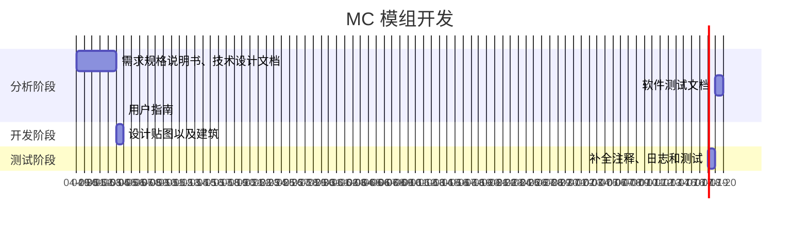

## 时间安排

MC 模组开发要做的事情还挺多的，还是需要安排一下，之前一直在靠感觉做。因为现在 2025-04-26，就以今天开端。

因为没有及时维护，导致现在 2025-04-29 很难处理，重新以 04-29 为开端。

## 代办事项

- [ ] 末影弓没有物品栏动画。
- [ ] 末影弓使用后不掉耐久。
- [ ] 末影弓无法被小白等生物使用。
- [ ] 紫颂果干保证每次使用必定瞬移。
- [ ] 末影弓数值过于爆炸，需要平衡。
- [ ] 修改物品合成配方使其与需求分析文档说明一致。
- [ ] 添加末影指南针。
- [ ] 实现末地重生锚。
- [ ] 实现末影共振器。
- [ ] 实现珍珠存储罐。
- [ ] 设计末地核心建筑。
- [ ] 设计末影祭坛建筑。
- [ ] 末地随机生成末影祭坛。
- [ ] 末地生成末地核心。
- [ ] 末地生成幽影翼。
- [ ] 设计末地守护者。
- [ ] 为模组代码添加文档注释。
- [ ] 为全部物品添加专门的纹理。

