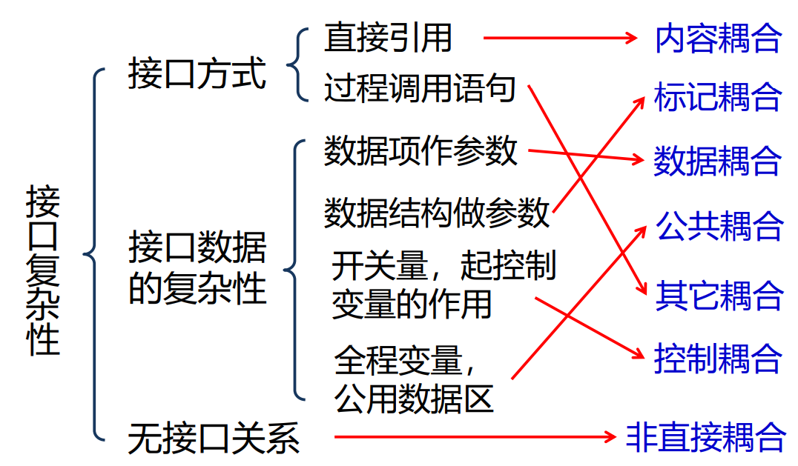
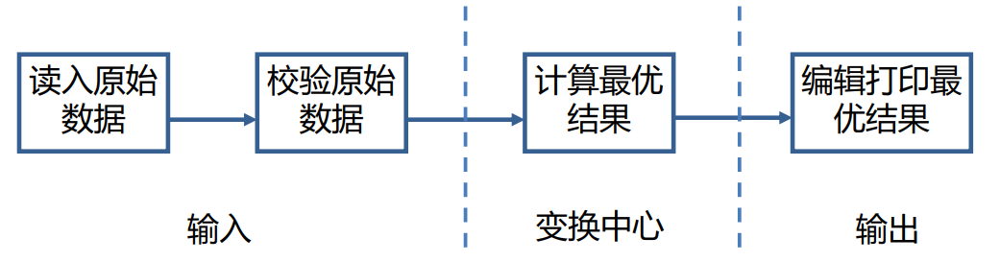
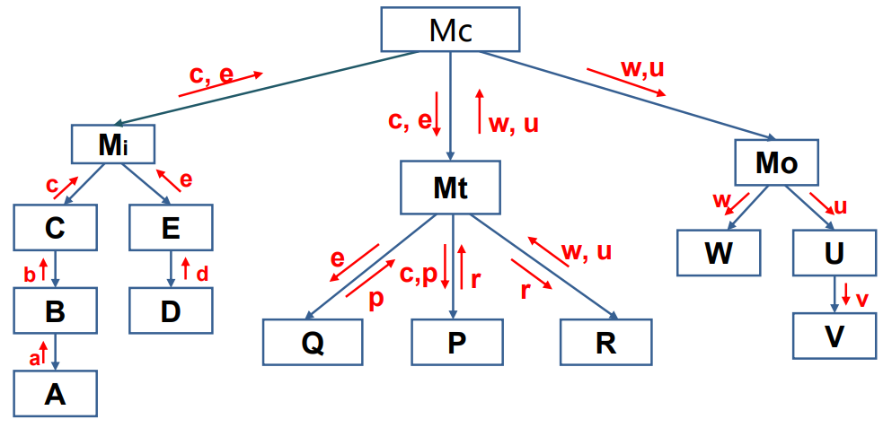

结构化分析其基本思想为**分解和抽象**。其过程为：

1. 建立当前系统（现在工作方式）的概念模型。系统的概念模型就是现实环境的忠实写照，可用**系统流程图**来表示。
2. 抽象出当前系统的逻辑模型。分析系统的概念模型，抽象出其本质的因素，排除次要因素，可用**数据流图 DFD 图等**描述的当前系统的逻辑模型。 
3. 建立目标系统的逻辑模型。可以理解看自己的模型是否贴近期望的系统，然后优化。
4. 建立人机交互接口和其他必要的模型，确定各种方案的成本和风险等级，据此对各种方案进行分析，选择其中一种方案，建立完整的需求规约。

## 分析模型

分析模型由功能模型、数据模型和行为模型构成。不同模型对应不同的图，参见 [[01-需求分析#使用工具模型]]。结构如下：

> [!note]
>  结构化分析这里是属于需求分析阶段，本章节后面才涉及结构化具体设计阶段。

### 功能建模——数据流图（Data Flow Diagram, DFD）

**聚焦于数据的流动和变换，数据变换代表系统需要完成的功能**，因此看似描述的是数据，实则体现出各功能对数据的处理。

#### 组成要素

1. 数据加工：又称数据变换。表示将输入数据转换成输出数据的过程，使用圆形框表示。
2. 外部实体：生产信息和接受信息，是数据的起点和终点。使用长方形表示。
3. 数据存储：字如其名，双横线表示。
4. 数据流：表示数据流动情况，箭头表示。最好在箭头上添加说明文字。

#### 设计步骤

1. 找出外部实体，确定起点和终点。
2. 找出外部实体输入输出数据流。
3. 画出外部实体。
4. 按照系统逻辑画出中间内容……

> [!tip]
> 根据数据加工部分确定系统功能。

#### 分层

当系统过于庞大时，一张数据流图难以表达完整系统，我们需要对数据流图分层。原则是“先全局后局部， 先整体后细节，先抽象后具体”。

顶层 DFD 图一般只有一张图：

整体结构，分别为顶层、第零层、第一层（a）、第一层（b）等等，**注意编号**：

#### 绘图原则

#### 数据字典

用于给**数据流图**中所有成分给出定义，和数据流图关系紧密。简单来讲就是给每个部分添加注释，说明这个部分的功能、作用。每一个解释就是一个词条，然后像字典那样整理起来。很繁琐，而且各有各的画法，也不是课程重点。有两种定义方式：

- 定义式：使用符号描述信息。
- Warnier 图：使用树形结构描述信息。

####  原子加工

在对数据流图的分解中，位于层次树**最低层**的加工称为基本加工或者原子加工。对于每一个基本加工都需要进一步说明它的内部逻辑。我们可以使用以下工具描述：

- 结构化语言：即伪代码。
- 判定树、判定表
- IPO 图

### 数据建模——实体-关系图（E-R Diagram）

按照用户观点对数据进行建模，**是来描述各数据间关系，实体就是数据**。

#### 组成要素

 1. 实体：即数据对象，具有独立意义的对象（如“学生”“课程”），圆角框表示。
 2. 属性：实体的特征（如“学号”“课程名称”），实际上**关系也可以有属性**。椭圆框表示。
 3. 关系：实体间的联系（如“选课”），用菱形框连接两个实体，线条是无向边。线条上数字代表这是几对几的关系，例如 $1 - N$ 代表一对多。

> [!note]
> 与面向对象的类不同的是这里的实体**仅仅封装了数据，而没有对施加在数据上的操作的引用**。可以认为是 C 中的结构体。

#### 约束条件
  
 1. 关系类型：1:1（一对一）、1:N（一对多）、M:N（多对多）。  
 2. 主键：用**下划线**标识唯一标识实体的属性或属性组（如“学号”）。  

#### 设计步骤

1. 找到实体
2. 找到关系
3. 定义属性
4. 定义主键

> [!EXAMPLE]
> 某汽车运输公司拥有多个车队，车队有车队号、车队名；车队的车辆都必须登记车牌照号、厂家、出厂日期；每个车队可以聘用若干司机，有聘用期；司机需登记司机编号、姓名、电话；司机可以驾驶多台车辆，需记录使用日期和公里数；每辆车也可被多个司机使用。要求：绘制出汽车运输管理系统的 E-R 图。

> [!NOTE]- 答案
> 

> [!NOTE] 与数据字典联系
> E-R 图的属性也可以利用数字字典来加以说明。利用实体的编号来引用属性，这样可以避免名字冲突。

> [!NOTE] 现代 ER 图
> 课程提及的实体关系图和 mermaid 或 draw.io 提供的图形都不太一样。课程使用的是 Chen 式 ER 图。
> 
> **Chen 式 ER 图**（Chen Notation）是数据库设计领域的经典模型，由美籍华人计算机科学家 **Peter Chen（陈品山）** 在 **1976 年** 发表的论文《The Entity-Relationship Model》中首次提出。它是 **ER 模型（Entity-Relationship Model）** 的标准化表示方法，至今仍是数据库教学和学术研究中的基础工具。
> 
> 随着软件开发工具的普及（如 MySQL Workbench、PowerDesigner），以及敏捷开发的需求，ER 图的表示逐渐简化，更注重**直接映射数据库表结构**。也就是 mermaid 用的图。
> 
> 和 Chen ER 图相比，关系采用主键、外键和线条联系。每个属性要有对应的**数据类型**。然后可以添加说明。

#### 1. **核心元素与符号**

### 行为建模——状态转换图 (State Transition Diagram, STD)

描述一个系统或对象在不同事件触发下的状态变化（如“订单”从“待支付”到“已发货”），**适合事件驱动的系统**。行为建模的方法有**控制流图和状态转换图**。

> 除了功能模型和数据模型以外，**有时**也需要建立系统的行为模型（或称为控制模型）。因为存在这样的一大类应用软件——它们是**事件驱动的，而不是数据驱动的**；产生控制信息，而不是报告或显示值；处理信息时非常关注时间和性能。这些应用软件在数据流建模以外还需要使用控制建模。

> [!NOTE]
> 对于非数据驱动的系统，像游戏。它们是通过事件驱动，描述数据流图或 E-R 图没啥意义（就需求分析上），没必要非要用以数据流为中心的图来描述。

#### 控制流图

用来进行行为建模的另一种图，不过不是课程重点。

> [!NOTE] 控制流图与状态转换图区别
> | **维度**       | **控制流图（CFG）**                  | **状态转换图（STD）**                 |
> |----------------|--------------------------------------|---------------------------------------|
> | **关注点**     | 系统功能的执行顺序和逻辑流程          | 系统或对象的状态变化及触发条件          |
> | **适用场景**   | 流程驱动的系统（如订单处理、审批流程） | 状态驱动的系统（如设备控制、订单状态机） |
> | **核心元素**   | 处理步骤、分支、循环、并行操作        | 状态、事件、转换条件、动作              |
> | **典型应用**   | 业务流程建模、算法逻辑分解            | 复杂状态管理、事件响应行为建模          |
> 
> 在大多数功能建模场景中（尤其是流程驱动的业务系统），CFG 的使用频率更高，因其能直接映射业务流程，便于分解功能模块。

#### 组成要素

1. 初始状态：实心圆表示
2. 最终状态：实心圆外层添加一圈。
3. 中间态：圆角矩形
4. 状态转换：箭头，箭头上面写明什么事件触发的，不写明代表会自动转换。

#### 设计步骤

> 状态转换图既可以表示系统循环运行的过程，也可以表示系统的单程生命期。当描绘循环过程时，通常不关心循环是怎样启动的。当描绘单程生命期时，需要标明初始状态和最终状态。
> 
> 例：图书管理系统如何判断一本书是否可借的条件是： 图书馆库存的该图书的可借册数（n）大于预约该图书的借者数目（m）。用状态图来描述系统的借与不借的行为。
> 
> ![[03-课程学习/软件工程理论与实践/attachments/image.png]]

## 概要设计

当我们得到分析模型后下一步就是进行概要设计，概要设计就是将**分析模型转换成设计模型（软件架构 + 模块结构）**的过程。流程如下：

1. 体系结构设计：根据需求说明、分析模型得出。
2. 数据结构设计：从数据模型和数据字典出发得出。
3. 接口设计：通过数据流图和控制流图得出。
4. 过程设计：根据过程说明（？）、控制说明（？）和状态转换图得出各个功能的过程化描述。

### 设计原则

> [!Note]
> 在得到分析模型后，我们要开始设计程序。不要分为概要设计和详细设计.

1. 模块化
2. 抽象 
3. 求精：逐步细化模块功能。
4. 信息隐藏
5. 功能独立性：模块应**高内聚、低耦合**。

#### 耦合类型

- 非直接耦合：由主模块间接连接，功能独立性最强。
- 数据耦合：被调用模块输入、输出都是**简单**的数据参数，通过参数传递数据（最优）。  
- 标记耦合：和数据耦合类似，但模块间传递的是数据结构地址（复杂的数据参数，像数组名、文件名等）。
- 控制耦合：通过参数传递控制信息（需谨慎）。
	- 实质是在单一接口上选择多功能模块中的某项功能。  
- 外部耦合：和外部组件交互，如数据库。
	- 必不可少，但这种数目应尽量少。
- 公共耦合：多个模块共享全局数据（风险高）。  
	- 调试困难。
- 内容耦合：直接修改其他模块内部数据（应避免）。
	- 例如通过 `goto` 语法直接跳到另一个模块内部。

#### 内聚类型（由低到高）

内聚比耦合更重要，高内聚往往代表低耦合。下面是内聚程度图

1. 偶然内聚：模块内元素无逻辑关联。  
2. 逻辑内聚：执行**相似但无关**的操作。  
	- 往往需要进行控制耦合。
3. 时间内聚：在同一时间段执行操作。  
4. 过程内聚：按特定流程执行操作。  
5. 通信内聚：操作同一数据集。  
	- 通常，通信内聚模块是通过数据流图来定义的。例如将多个数据合并成一个数据。
6. 顺序内聚：前一步输出是后一步输入。  
7. 功能内聚：模块仅完成单一功能（最优）。
	- Less is More.

### 常见体系结构

1. 数据流体系结构
2. 调用和返回体系结构
	1. 主程序/子程序体系结构
	2. 远程过程调用体系结构
3. 面向对象体系结构
4. 层次体系结构：例如计算机网络的[体系结构](01-网络概述.md#体系结构)。

### 设计工具

1. 层次图：描述模块层次，一 个矩形代表一个模块，框间的连线表示调用关系。
2. 结构图（SC）：描述模块调用关系，在下面[设计方法](#设计方法)中使用。
	- 模块：用矩形框表示，框内注明模块的名字或主要功能。
	- 模块间调用关系：模块之间用箭头(或直线) 联结，箭头从调用模块指向被调用模块。
	- 特殊符号：在模块下面附加特殊符号有不同含义。
		- 菱形符号：表示主模块**有条件**地调用子模块。
		- 弧形符号：表示主模块**反复**调用子模块。
		- 例如 

### 设计方法

通过映射把**数据流图变换成软件的模块结构**。根据信息流类型使用不同的映射方法，我们使用结构图描述。

#### 数据流类型

- **变换型**：  
   - 结构：输入 → 变换中心 → 输出。  
   - 设计步骤：识别输入流、变换中心、输出流，映射为分层结构。  
   - 特点：具有较明确的具有较明确的输入、变换和输出。如图
   
   
   
- **事务型**：  
   - 结构：事务中心根据输入类型选择处理分支。  
   - 设计步骤：识别事务中心，分解为调度模块和分支模块。
   - 特点：输入、输出不明确。有不同类型的输入输出，分类一下比较清晰。如图

#### 变换分析

将具有**变换流**特点的数据流图映射成**模块结构**的分析方法。有输入、中心变换和输出三部分，如图

1. 根据数据流图确定**逻辑**输入、**逻辑**输出和变换中心。
	- **在数据流图中划分区域**，一般先确定输入输出，这样剩下部分就是变换中心。
2. 设计**软件结构**的顶层和第一层。如图 
3. 设计中、下层模块。

例如

第二层

完整 SC 图：

> [!NOTE]
> 注意**数据是自上向下传递、自下向上变换的**。数据是从夫模块传递到子模块（函数调用），不过这个传递过程并不重要。

> [!EXAMPLE]- 教材购销系统销售子系统
> 
> 
> 这里对数据存储的交换也是一个模块。

#### 事务分析

在数据流具有明显事务特点（一个数据出现多种可能变换的数据），虽然同样可以使用变换分析，但使用事务分析更合适。

1. 确定事务中心和加工路径。
2. 设计顶层和第一层。
3. 设计中、下层模块，步骤和变换型一致。

例如

可以发现 `a` 数据**由事务控制进行转换**，而且使用了结构图的菱形符号。

> [!NOTE]
> 在实际画图中，变换型和事务型可以组合使用，并不冲突。

### 概要分析说明书

概要设计说明书是概要设计阶段的工作成 果，它应说明功能分配、模块划分、程序的总体结构、输入输出以及接口设计、运行设计、 数据结构设计和出错处理设计等，为详细设计 提供基础。

## 详细设计

目标是细化模块内部逻辑（代码级实现方案）。任务

- 确定每一模块的具体算法。
- 确定每一模块使用的数据结构。
- 确定模块的外部接口和用户界面。
- 为每一模块设计一组测试用例。
- 编写详细设计说明书，参与评审。

### 工具

1. 程序流程图：描述程序执行流程。  
2. 盒图（N-S图）：结构化流程图，无箭头。  
3. 问题分析图（PAD）：树状结构表示程序逻辑。
4. 判定表：可以清晰描述判断条件。
5. 判定树。
6. 过程设计语言（PDL）：伪代码。

## 结构化需求分析步骤

1. 需求收集与整理
2. [功能分解与数据流建模](#功能建模——数据流图（Data%20Flow%20Diagram,%20DFD）)
	 - 核心工具：数据流图（Data Flow Diagram, DFD）
	 - 通过分层DFD描述系统的数据处理逻辑：
	    - Level 0 DFD：系统整体输入/输出和外部实体。
	    - Level 1 DFD：分解为关键处理过程（如“订单处理”“库存管理”）。
	    - Level 2+ DFD：进一步细化每个处理过程的子功能。
	- 输出：分层数据流图（DFD）。
3. [数据字典（Data Dictionary）](#数据字典)
	- 目标：明确定义系统中所有数据的结构和含义。
	- 输出：结构化数据字典文档。
4. [数据建模分析（可选）](#数据建模——实体-关系图（E-R%20Diagram）) 
5. [状态转换分析（可选）](#行为建模——状态转换图%20\(State%20Transition%20Diagram,%20STD\))
6.  [概要设计](#概要设计)
7. [详细设计](#详细设计)
8. 非功能性需求分析
9. 需求验证与确认
10. [需求规格说明书（SRS）](01-需求分析.md#需求规格说明书（SRS）)