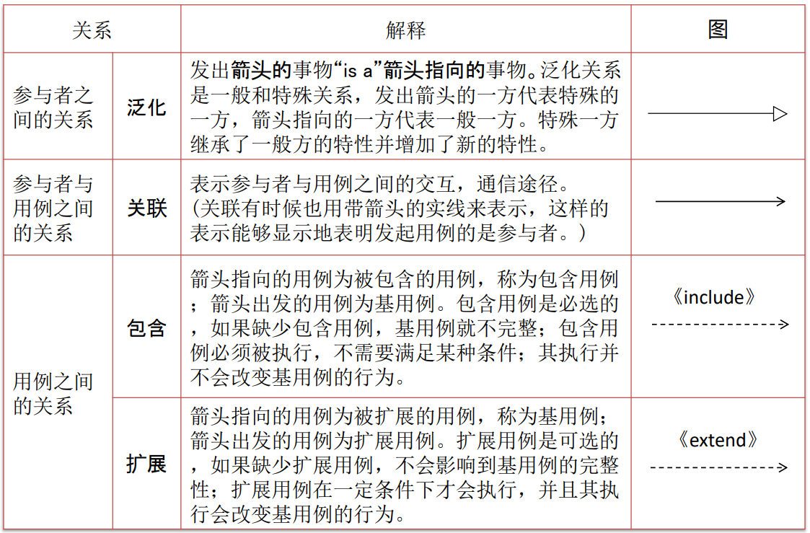
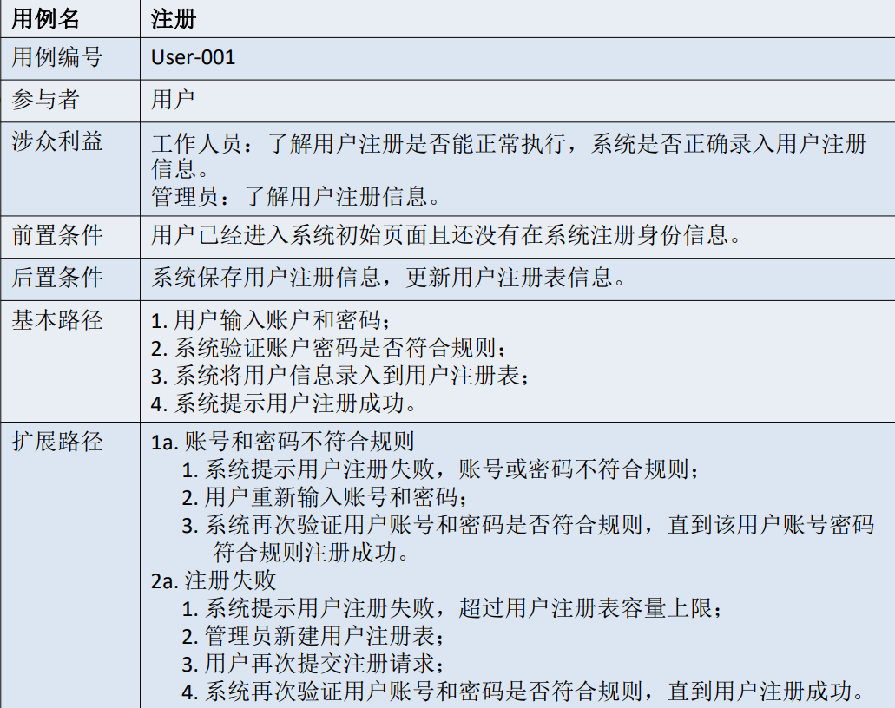
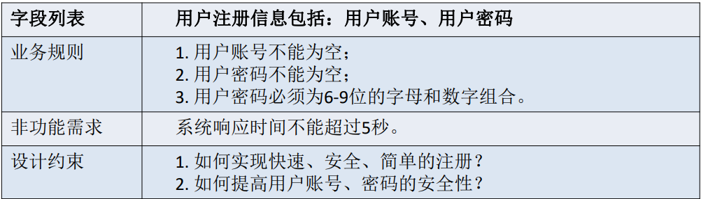
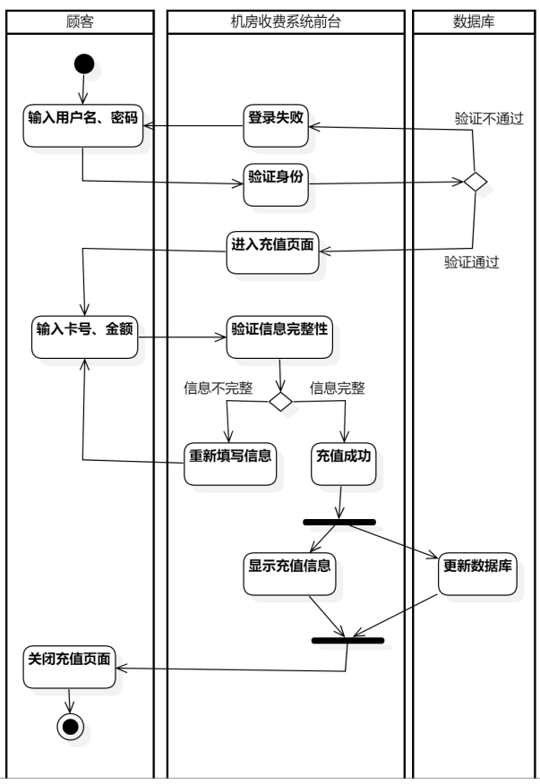
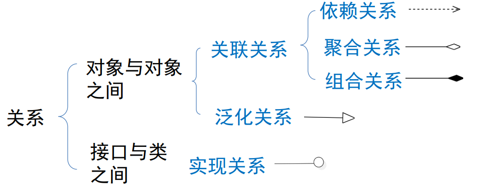

## UML

UML，即统一建模语言（Unified Modeling Language），是一种标准化的建模语言，由**一系列集成图**组成。它以不同角度对项目建模，称为视图，主要有下面几种视图：

- 用例视图(Use-case View)
	- 描述系统应该**具有的功能**，从系统外部用户的角度出发，实现对系统的抽象表示。例如用例图、活动图都适用。
- 逻辑视图(Logical View)
	- 也称为设计视图（Design View），用来揭示系统功能的内部设计和协作情况。用静态结构和动态行为描述系统的功能。
	- 静态结构：描述类、对象及其关系，主要用类图等。
	- 动态行为：描述对象之间发送消息时产生的动态协作，有活动图、时序图等。
- 进程视图（Process View）
	- 用于展示系统的动态行为及其并发性，也称为行为模型视图。有活动图、时序图等。
- 实现视图（Implementation View）
	- 描述对象是在哪个模块或组件中实现的。
- 部署视图(Deployment View)
	- 系统的实现环境和组件被部署到物理结构中的映射。

在面向对象这里，我们使用**统一建模语言（UML）**来进行分析模型的描述绘制（这代表同一个图的画法应该是一致的）。

> 像 mermaid 就支持大部分 UML 图，却不支持结构化分析的图。

> [!NOTE]
> 这里有一篇很好的[文章](基于UML的需求分析和系统设计（完整案例和UML图形演示）.md)，关于基于UML的需求分析和系统设计（完整案例和UML图形演示)。内容和本篇笔记相得益彰。

## 分析模型

与结构化分析的分析模型有些许区别，设计的顺序也不同，

1. 功能模型：描述功能，用 UML 的用例图、包图。
2. 行为模型：描述系统行为与其他系统或用户的交互，用 UML 的交互图（时序图、状态图、活动图等）。
3. 结构模型：描述系统静态结构，用 UML 的类图、对象图。

### 功能建模——用例图

由用例、参与者（用户或其它系统）和关系构成。标明系统提供哪些用例（功能）。寻找用例的步骤如下

1. 将活动图中的每个活动视为备选用例。如果没有活动图，那找需求说明的“动词”来确定有哪些活动也行。
2. 识别活动是否为系统用例。
	1. 活动使用者是否为系统内部对象。
	2. 活动是否使用系统提供的服务。
	3. 活动是否是系统服务。
	4. 满足其中一个即可确定。
3. 绘制用例图。

#### 关系

- 关联：参与者与用例之间的关系，直线表示。
- 包含：用例之间的关系，虚线箭头 + <<包含>>二字表示。
- 扩展：用例之间的关系。虚线箭头 + <<扩展>>二字表示。
- 泛化：参与者之间的关系。即继承关系，直线 + 空心三角形。

> [!NOTE] 更多内容
> 关于用例图的更多内容见[2. 需求收集——用例图](基于UML的需求分析和系统设计（完整案例和UML图形演示）.md#2.%20需求收集——用例图)。

### 实现构造的用例

实现构造的用例是面向对象分析**最核心**的工作。是为了获得实现用例行为所必须的分析类，利用分析类描述其实现逻辑。步骤如下

1. 完善用例文档。
2. 识别分析类，设计类图。这个就看你经验了，根据用例文档名词筛选。
3. 分析交互，划分职责，完善类图。交互使用时序图（顺序图）等研究，见[3、表达对象交互](基于UML的需求分析和系统设计（完整案例和UML图形演示）.md#3、表达对象交互)。
4. 完成参与类类图。

#### 用例文档

每一个用例对应于一个用例文档。在文档中用文字的方式描述用例的执行过程，即参与者与系统的交互过程。

一个完整的用例文档包括用例名、用例编号、参与者、涉众利益、前置条件、后置条件、基本路径、 扩展路径、字段列表、业务规则、非功能需求和设计约束等。例如

### 行为建模——活动图

使用活动图描述不同对象之间的活动序列，即从一个活动到另一个活动的控制流。活动图是用例图的细化。类似时序图，但是**不一定必须往下走**，更加灵活。例如

> [!TIP]
>  构建的活动图与用例图间的关系：一个用例扩展成一个活动图。
>  
>  如果对项目把控程度好，直接从用例图开始，把控程度不好从活动图开始。

> [!TIP]
> 关于活动图的更多内容，例如注意事项、使用场景等等，见[2）业务流程分析——活动图](基于UML的需求分析和系统设计（完整案例和UML图形演示）.md#2）业务流程分析——活动图)。

### 结构建模——类图

类图中的类由一个大矩形构成，大矩形中的小矩形盛放属性。类之间的关系由不同类型线段连接。建模流程如下：

1. 确定需求（用例文档）中涉及的实体和关联。
	1. 勾画出需求中所有名词。
	2. 剔除与系统无关的名词。
	3. 分辨其它名字的“力度”与组成关系。力度大的作为类，力度小的作为属性。
	4. 绘制图并建立关系。

#### 关系

- 关联：直线表示。仅仅表示有关系。在Java中表现为一个对象的类代码中包含有另一个对象的引用。
- 依赖：带箭头的虚线表示。表示会受到箭头类变化的影响。`uses-a` 关系，例如《C++ Primer Plus》中提及的电视和遥控器。
- 泛化：实线 + 空心箭头。表示继承关系。`is-a` 关系。
- 实现：虚线 + 空心箭头。就像 Java 中的接口一样，实现接口中的方法，叫做实现关系。在《C++ Primer Plus》称为 `is implemented as a` 关系。
- 聚合（聚集）：表示整体和部分的关系。`has-a` 关系，例如《C++ Primer Plus》提及的汽车和汽车引擎关系。
	- 共享聚集：空心菱形 + 直线。整体没了，个体还在。
	- 组合聚集：实心菱形 + 直线。整体没了，个体也没。`contains a` 关系，可以认为是类的成员变量。

## 面向对象需求分析步骤

1. 需求收集与整理
2. 建立用例模型（Use Case Model）
	- 目标：通过用户视角描述系统功能，明确系统与外部实体的交互。
	- 关键活动：
	    - 识别参与者（Actors）：系统外部的用户、设备或其他系统（如“管理员”“支付接口”）。
	    - 定义用例（Use Cases）：描述参与者与系统的交互场景（如“用户登录”“生成报表”）。
	    - 编写用例描述：详细说明每个用例的触发条件、流程步骤、异常处理等。
	    - 绘制用例图：可视化参与者与用例的关系（UML用例图）。
	- 输出：用例图、详细的用例文档。
3. 构建领域模型（Domain Model）
	- 目标：抽象现实世界的业务概念，定义系统中的核心对象及其关系。
	- 关键活动：
	    - 识别领域对象：从需求中提取名词（如“订单”“客户”“产品”），作为候选类。
	    - 定义类属性与方法：明确类的数据（如“订单号”“订单日期”）和行为（如“计算总价”）。
	    - 建立类关系：通过继承（is-a）、关联（has-a）、聚合/组合等关系连接类（如“订单包含多个商品”）。
	    - 绘制类图（Class Diagram）：用UML类图表示静态结构。
	- 输出：领域类图、对象关系描述文档。
4. 分析动态行为（Dynamic Behavior Analysis）
	- 目标：描述系统在运行时的动态交互和状态变化。
	- 关键活动：
	    - 状态图（State Diagram）：描述对象生命周期中的状态变迁（如“订单”从“待支付”到“已完成”）。
	    - 活动图（Activity Diagram）：展示用例的流程逻辑（如“用户下单”的步骤分支）。
	    - 时序图（Sequence Diagram）：分析对象间的消息传递顺序（如“用户界面”调用“支付接口”）。
	- 输出：状态图、活动图、时序图等动态模型。
5. 非功能性需求分析
6. 需求验证与确认
7. [需求规格说明书（SRS）](01-需求分析.md#需求规格说明书（SRS）)