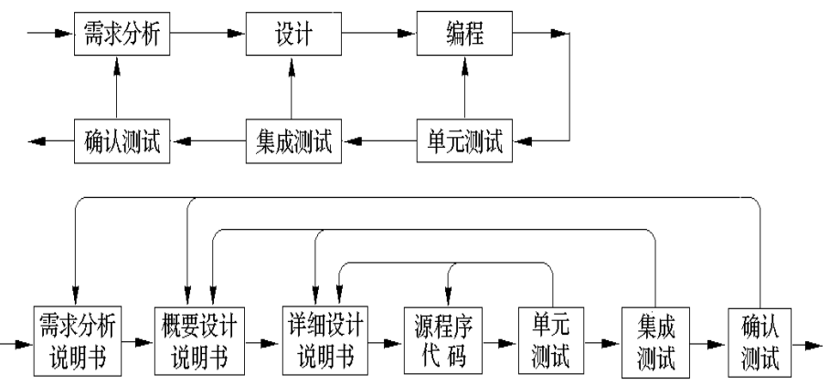

## 分类

软件测试主要分为两大类：

- 静态测试：不运行代码
	-  代码审查(Code Review)：检查文档和代码是否符合规范等。
	- 静态结构分析：对已经设计好的内容进行检查，能找到 30 ~ 70% 的逻辑设计缺陷
- 动态测试：将代码运行
	- 白盒测试：可以看到模块代码。
	- 黑盒测试：看不到代码，只能进行输入，验证输出。

> [!TIP] 软件测试流程
> 先单元测试，然后集成测试，与用例图关联，进行功能测试，得到完整用例图可以再进行系统测试，最后验收测试。

## 动态测试

静态测试我们这里并不涉及。只讨论动态测试。

### 白盒测试

给程序特定的输入，检验是否产生符合预期的输出。白盒测试主要使用两种方法：

- 逻辑覆盖法。
	- 语句覆盖：把语句过一遍。
	- 判定覆盖：又称分支覆盖，在语句覆盖基础上还要把选择语句的两个可能的结果都执行一遍。
	- 条件覆盖：走过每个条件的情况，不一定要过一遍每个判定结果。例如 `A == 1 || B == 2`，我们要走过四种条件情况，A 等于，A 不等于，B 等于，B 不等于。
	- 判定/条件覆盖：在条件判定覆盖基础上还要符合判定覆盖。
	- 条件组合覆盖：那个判定中的每个条件的各种组合也要出现一次。例如 `A > 1 and B == 0`，有真真，假假，真假，假真。与条件覆盖的区别在于**组合**，条件覆盖只需要让条件出现过真假两个状态就行，并不关心整体条件结果。
	- 路径覆盖：把所有可能路径都覆盖一遍。
- 基本路径测试法：不涉及。

> [!TIP]
> 逻辑覆盖法主要是针对选择语句。
> 
> 课程主要考察**判定和条件覆盖**，处于单元测试阶段。

> [!TIP] 逻辑覆盖法画图例子
> 再使用逻辑覆盖法时，推荐按下图有条理地把选择的条件画出来。根据覆盖类型不同，可以忽略一些列。
> 

### 黑盒测试

白盒测试主要用于项目早期，黑盒测试主要用于项目后期。主要依据是规格说明书和用户手册。常用方法有：

- 等价类划分法：课程主要内容。
- 边界值分析法：对等价类划分法的补充，设计等价类边界值测试。
- 因果图法：输入数据间有约束关系或多种组合时使用。用在有相互复杂的因果关系的系统下。

#### 等价类划分法

理论依据为程序对于同类型地输入表现出来的行为基本相同。因此我们可以根据**不同的性质**，将输入数据划分成几个不同的集合类。再分别从里面选出数据测试。有两种等价类：

- 有效等价类：对于程序来说是合理、纳入设计考虑的数据构成的集合。
- 无效等价类：对于程序来说是不合理，未纳入设计考虑的数据构成的集合。

一般有这几种划分方法：

- 按区间划分
- 按数值划分：例 $A = XXX$ 和 $A \not= XXX$，分成有效和无效等价类。
- 按数值集合划分：按数值划分的进一步扩展。例 $A \in B$ 和 $A \notin B$ 分成有效和无效。
- 按处理方式划分：根据数据在程序中处理方式的不同进一步划分。

步骤：

1. 画出等价类表，每一个等价类有唯一编号。如图：

2. 设计测试用例，用例应尽可能多地覆盖有效等价类。直到全部覆盖。
3. 设计测试用例，只覆盖一个无效等价类。重复设计直到覆盖全部无效等价类。

> [!NOTE] 例子
> 

#### 因果图法

步骤如下：

1. 分析规格说明，找出原因（？通常是输入条件）和结果（？通常是输出条件）。
2. 找出原因和结果之间的关联，画在因果图上。原因-中间状态-结果，并把那个事进行编号，最后使用图来进行连接。
3. 在因果图上补充约束条件。
4. 将因果图转换成判定表。
5. 根据判定表每一列编写测试用例。

因果图基本符号：

约束符号：

> [!EXAMPLE]
> 有一个处理单价为 1 元 5 角的盒装饮料的自动售货机软件。若投入 1 元 5 角硬币，按下“可乐”，“雪碧”　或“红茶”按钮，相应的饮料就送出来。若投入的是两元硬币，在送出饮料的同时退还 5 角硬币。

> [!NOTE]- 答案
> 
> 
> 
> 

## 测试类型

- 单元测试
	- 需要考虑所测模块和其他模块的联系。一般正式模块并未完成，需要为每个单元提供驱动模块和桩模块。驱动模块接收输出，桩模块提供输入。
- 集成测试
	- 在单元测试基础上，将模块按照总体设计进行组装来测试。
-  系统测试
	- 作为完整应用在操作系统上测试。
- 验收测试

下图是测试阶段的返工流程，确认测试是通过实际使用场景模拟，确保软件满足用户需求，并能在真实环境中按预期运行。

