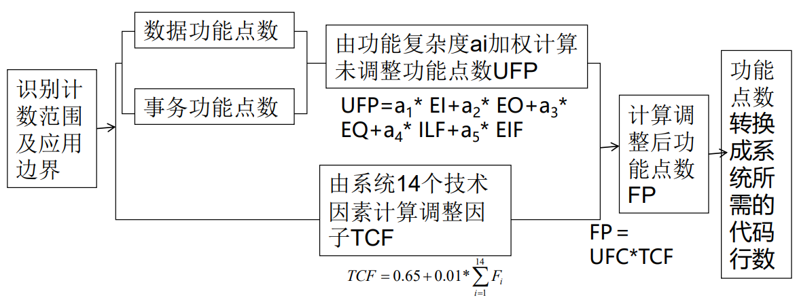
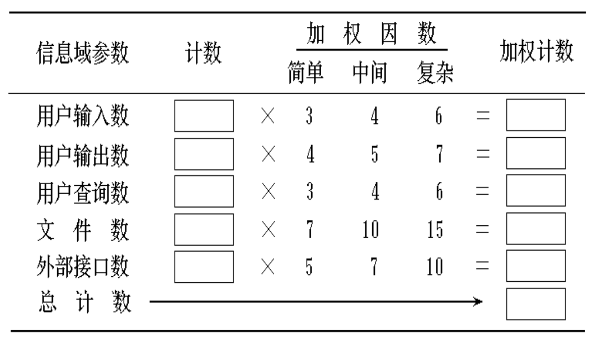
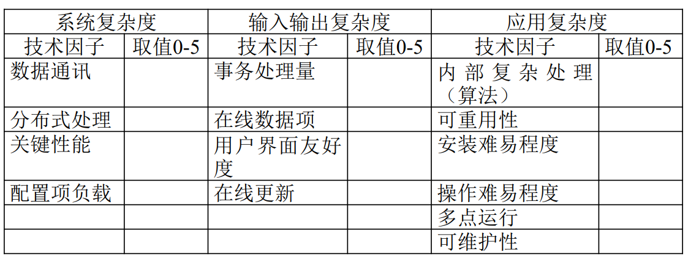

## 德尔菲法

德尔菲法采用匿名发表意见的方式，即专家之间不互相讨论和联系，只能与调查员（组织者）通信，通过多轮次调查专家对问卷所提问题的看法，经过反复征询、归纳、修改最后汇总成专家基本一致的看法，作为预测的结果。

## 代码行分析法（LOC）

代码行分析方法（LOC，Line of Gode）是最流行的软件项目规模的定量估算方法，它根据以往开发类似项目的历史数据来估算一个功能可能需要的源程序代码的行数，以 KL0G（千代码行）作为计量单位。有几种办法

- 基于以往的统计数据估算
	1. 首先建立一个面向规模的数据表格，记录过去几年完成的每一个软件项目和关于这些项目的相应面向规模的数据。
	2. 对于每一个项目，可以根据表格中列出的基本数据进行一些简单的面向规模的生产率和质量的度量。
- 经验估算法
	1. 多名人员给出三个估计值，最小行数（a）、最大行数（b）、最有可能的行数（m）。
	2. 计算其平均值。
	3. 估计代码行数，$L = \frac{{\bar{a} + 4\bar{m} + \bar{b}}}{6}.$
	4. 估算工作量(人、月数)=代码总估算长度/估算生产率。(估算生产率由经验获得）
	5. 估算总成本=月平均薪水估算工作量。

## 功能点分析法

功能点（Function Point，FP）是用系统的功能数量来测量其规模，它以一个标准的单位来度量软件产品的功能，与实现产品所使用的语言和技术没有关系，通常在软件系统设计初期斯进行估算。功能点度量是为信息系统应用而设计的。

功能点技术定义了五个特性来描述复杂度
1. 输入项数（$Inp$）：用户向软件输入的提供应用的数据项数，不包括用于查询的输入数。
2. 输出项数（$Out$）：软件输出的项数。报表、屏幕、出错信息等（不包括报表中的数据项）。
3. 查询项数（$Inq$）:用户所有可能的查询数。
4. 主文件项数（$Maf$）：逻辑主文件的项数。（如数据的一个逻辑组合，它可能是某个大型数据库的一部分或是一个独立的文件）
5. 外部接口数（$Inf$）:机器可读的全部接口数。

计算过程：

外部输入$EI$，外部输出 $EO$，用户查询 $EQ$，内部逻辑文件 $ILF$，外部接口文件 $EIF$。

1. 计算数据功能点数，事务功能点数。
2. 未调整功能点数 $UFP = \sum(\text{功能} \times \text{功能复杂度})$
3.  计算调整权重，$TCF = 0.65 + \text{技术复杂因子和} \times 0.01$。
4.  相乘得到功能点数，$FP = UFP \times {TCF}.$
5. 功能点数可以和平均功能实现代码数相乘来获得大概的项目代码数。除以每月代码数还可以估算花费时间。
	- 估算工作量 = 项目估算 $FP$ / 估算生产率（由经验获得），一般工作量通常是人月（pm）。
	- 估算总成本 = 平均月工资×估算工作量。

### $UFT$

计算 $UFT$ 要以软件功能**复杂性的度量值**作为估算参数。越复杂 $a_{i}$ 越大，权重越高。**具体大小根据给出的表计算**。

$$
U F P=a_{1} \times I n p+a_{2} \times O u t+a_{3} \times I n q+a_{4} \times M q f+a_{5} \times I n f
$$

计算例子：

### $TCF$

计算技术复杂因子（$TCF$）将度量 14 种技术因素对软件规模的影响程度。每一项的取值范围在 0 到 5 之间（0 表示无，5 表示最大）。

